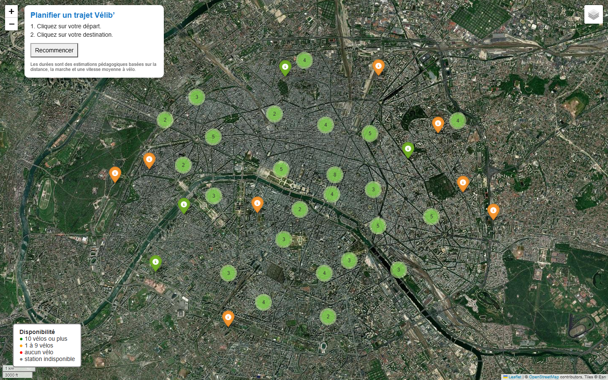
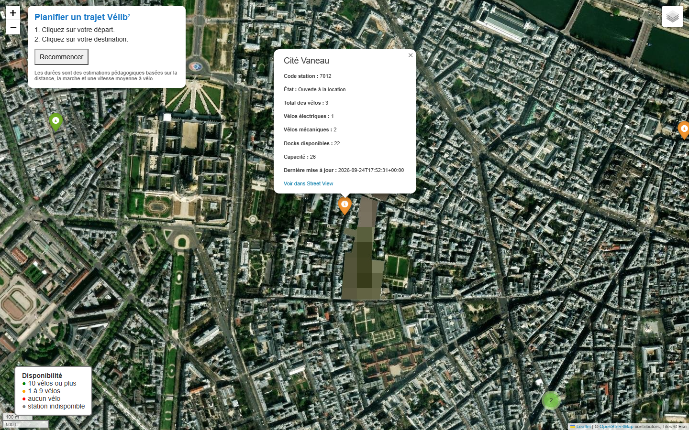
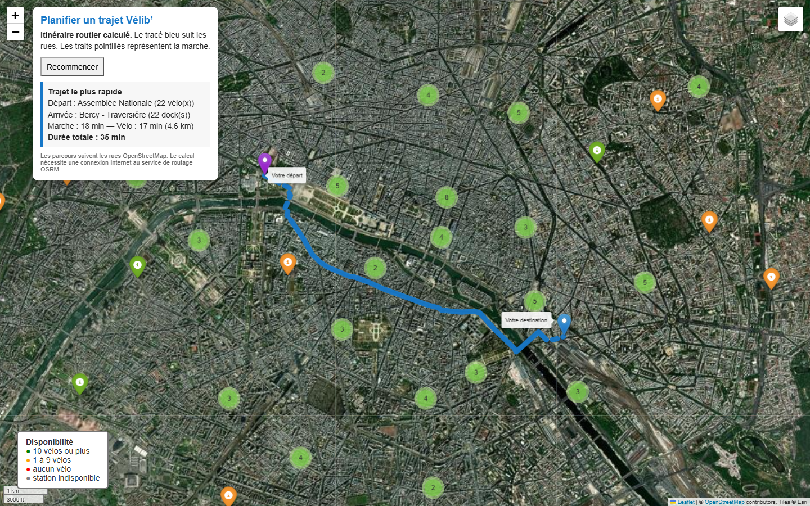

# Vélib' : MongoDB, Folium et Hadoop MapReduce

Ce projet exploite des données de stations Vélib' avec Python et MongoDB, puis les affiche sur une carte Folium interactive. Il contient également un exercice Hadoop MapReduce en Java consacré à l'analyse d'associations de produits.

## Fonctionnalités

- import de 100 stations issues des flux GBFS officiels Vélib' ;
- stockage des stations dans MongoDB ;
- lecture et filtrage avec PyMongo ;
- validation de plusieurs structures de documents JSON ;
- carte Folium avec marqueurs, regroupement et légende de disponibilité ;
- popups détaillant les vélos et les docks disponibles ;
- sélection libre d'un départ et d'une destination ;
- proposition du trajet le plus rapide suivant les rues et les voies cyclables ;
- recherche facultative autour d'une adresse avec GeoPy ;
- tests automatisés avec pytest ;
- exercice Hadoop MapReduce en Java.

## Architecture

```text
Flux GBFS -> MongoDB -> PyMongo -> normalisation Python -> carte Folium
                                                   -> routage OSRM

donnees.csv -> MonMapper -> Shuffle Hadoop -> MonReducer -> résultats HDFS
```

Les deux chaînes sont indépendantes. MongoDB alimente l'application cartographique. Hadoop illustre un traitement distribué par lots sur un fichier CSV.

## Prérequis

- Python 3.10 ou supérieur ;
- MongoDB accessible sur `mongodb://localhost:27017/` ;
- PowerShell pour les scripts de lancement ;
- Java et Hadoop pour la partie MapReduce.

## Installation

```powershell
.\setup.ps1
```

L'installation manuelle est également possible :

```powershell
python -m venv .venv
.\.venv\Scripts\python.exe -m pip install -r requirements.txt
```

## Chargement des données

Pour charger 100 stations officielles dans MongoDB :

```powershell
.\refresh_velib.ps1 --limit 100
```

Le script fusionne les informations générales des stations avec leurs disponibilités. Il sélectionne cinq stations dans chacun des vingt arrondissements de Paris.

Pour utiliser uniquement le petit jeu local de démonstration :

```powershell
.\load_demo_into_mongodb.ps1
```

## Lancement de la carte

```powershell
.\run.ps1
```

Configuration MongoDB par défaut :

```text
URI        mongodb://localhost:27017/
Base       velib_db
Collection velib_collection
```

La carte générée s'ouvre automatiquement dans le navigateur. Deux clics permettent de choisir un départ et une destination. L'application compare les stations proches disposant d'un vélo au départ et d'un dock à l'arrivée, puis affiche le trajet le plus rapide.

## Utilisation de la carte

### 1. Explorer les stations

La carte affiche les stations sur Paris. Les stations proches sont regroupées dans des cercles numérotés. Il suffit de zoomer ou de cliquer sur un groupe pour voir les marqueurs individuels.

Le bouton situé en haut à droite permet de choisir entre le fond OpenStreetMap et la vue satellite. La légende en bas à gauche indique la disponibilité :

- vert : au moins 10 vélos ;
- orange : entre 1 et 9 vélos ;
- rouge : aucun vélo ;
- gris : station indisponible.



### 2. Consulter une station

Un clic sur un marqueur ouvre une fiche détaillée. Elle indique le code de la station, son état, le nombre de vélos électriques et mécaniques, les docks disponibles, la capacité totale et la date de mise à jour.

Le lien `Voir dans Street View` ouvre directement l'emplacement de la station.



### 3. Planifier un trajet

Le panneau en haut à gauche guide l'utilisateur :

1. cliquer une première fois sur le point de départ souhaité ;
2. cliquer une deuxième fois sur la destination ;
3. consulter le trajet le plus rapide affiché.

Le trajet bleu correspond au parcours routier le plus rapide. Il suit les rues à partir des données OpenStreetMap. Les traits pointillés montrent les parties effectuées à pied. Le panneau indique les stations retenues, les vélos ou docks disponibles, la durée de marche, la durée à vélo, la distance cyclable et la durée totale.

Le planificateur utilise les services OSRM dédiés à la marche et au vélo. Une connexion Internet est nécessaire au moment du calcul.

Le bouton `Recommencer` efface la sélection et permet de choisir deux nouveaux points.



### Filtrer les stations

Afficher uniquement les stations ayant plus de dix vélos électriques :

```powershell
.\run_filter_10_ebikes.ps1
```

### Rechercher autour d'une adresse

```powershell
.\.venv\Scripts\python.exe app.py --address "10 rue de Rivoli, 75004 Paris" --radius 500
```

### Mode local sans MongoDB

```powershell
.\run_demo.ps1
```

## Structure d'un document

```json
{
  "fields": {
    "stationcode": "16107",
    "name": "Benjamin Godard - Victor Hugo",
    "coordonnees_geo": [48.865983, 2.275725],
    "ebike": 0,
    "mechanical": 9,
    "numdocksavailable": 26,
    "capacity": 35
  }
}
```

Le programme accepte aussi des champs placés à la racine et des coordonnées au format GeoJSON.

## Hadoop MapReduce

Le dossier `hadoop` contient :

- `MonMapper.java`, qui produit les paires de produits présentes dans chaque panier ;
- `MonReducer.java`, qui compte les associations et trie les produits associés ;
- `MonDriver.java`, qui configure le job, trois reducers et les chemins HDFS ;
- `donnees.csv`, le jeu de données d'entrée.

Le job lit `/mpmr/input` et écrit ses résultats dans `/mpmr/output`. Le dossier de sortie doit être absent avant chaque lancement.

## Tests

```powershell
.\.venv\Scripts\python.exe -m pytest -q
```

La validation actuelle comprend neuf tests automatisés. Le détail se trouve dans [TEST_STATUS.md](TEST_STATUS.md).

## Limites connues

- les disponibilités représentent un instantané et doivent être rafraîchies ;
- le routage dépend d'un service OSRM externe et ne tient pas compte du trafic en temps réel ;
- les tuiles cartographiques et le géocodage nécessitent une connexion Internet ;
- la démonstration utilise 100 stations et non l'ensemble du réseau.
